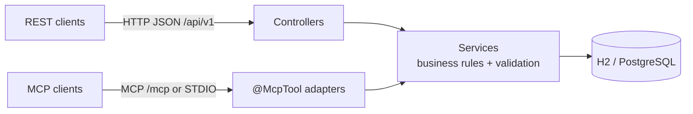

# RestAPIMCPDemo

A Spring Boot service for **employees and departments**. The same operations are available two ways:

- a **REST API** at `/api/v1/**`
- an **MCP server** at `/mcp` (Streamable HTTP) or over **STDIO**, with 14 tools, 2 resources and 2 prompts that any
  MCP client can use (Claude Code, Claude Desktop, VS Code, Cursor, MCP Inspector, custom agents)



Full design: [docs/architecture/ARCHITECTURE.md](docs/architecture/ARCHITECTURE.md) ·
Implementation plan: [docs/plans/](docs/plans/2026-10-07-employee-department-mcp-implementation-plan.md) ·
Client setup: [docs/guides/client-setup.md](docs/guides/client-setup.md)

**Stack:** Java 21 · Spring Boot 4.1 · Spring AI 2.0 (MCP server) · Spring Data JPA · Flyway · H2 / PostgreSQL · springdoc

## Quick start

Requires JDK 21+. The Maven Wrapper is included, so you don't need a Maven install.

```bash
./mvnw spring-boot:run            # PowerShell: .\mvnw.cmd spring-boot:run
```

| URL | What |
|---|---|
| http://localhost:8080/api/v1/departments | REST API (seeded with 4 departments, 12 employees) |
| http://localhost:8080/swagger-ui.html | OpenAPI / Swagger UI |
| http://localhost:8080/mcp | MCP endpoint (Streamable HTTP) |
| http://localhost:8080/actuator/health | Health |
| http://localhost:8080/h2-console | H2 console (`jdbc:h2:mem:empdept`, user `sa`) |

Try the MCP server without an AI client:

```bash
npx @modelcontextprotocol/inspector --cli http://localhost:8080/mcp --transport http --method tools/list
```

Or connect a real client. This repo ships [`.mcp.json`](.mcp.json) (Claude Code) and [`.vscode/mcp.json`](.vscode/mcp.json)
(VS Code), so opening the folder is enough once the server runs. For Claude Desktop (STDIO) see the
[client guide](docs/guides/client-setup.md).

## REST API

| Method | Path | Description |
|---|---|---|
| GET | `/api/v1/departments` | List departments with headcount |
| GET | `/api/v1/departments/{id}` | Get a department |
| POST | `/api/v1/departments` | Create |
| PUT | `/api/v1/departments/{id}` | Update |
| DELETE | `/api/v1/departments/{id}` | Delete (must be empty) |
| GET | `/api/v1/departments/{id}/employees` | Members |
| GET | `/api/v1/departments/{id}/summary` | Headcount, total and average salary, manager |
| PUT | `/api/v1/departments/{id}/manager/{employeeId}` | Assign a manager |
| GET | `/api/v1/employees?name=&departmentId=&status=&page=&size=&sort=` | Search (paged) |
| GET | `/api/v1/employees/{id}` | Get an employee |
| POST | `/api/v1/employees` | Create |
| PUT | `/api/v1/employees/{id}` | Update |
| DELETE | `/api/v1/employees/{id}` | Delete |
| PUT | `/api/v1/employees/{id}/department/{departmentId}` | Transfer |

Errors are RFC 9457 `application/problem+json`: 400 validation, 404 not found, 409 conflict, 422 business rule.
Sample requests are in [http/requests.http](http/requests.http).

## MCP capabilities

| Kind | Name | Notes |
|---|---|---|
| Tool | `list_departments`, `get_department`, `get_department_employees`, `get_department_summary` | read-only |
| Tool | `create_department`, `update_department`, `assign_department_manager` | write |
| Tool | `delete_department` | destructive, only if the department is empty |
| Tool | `search_employees`, `get_employee` | read-only |
| Tool | `create_employee`, `update_employee`, `transfer_employee` | write. Updates are partial |
| Tool | `delete_employee` | destructive |
| Resource | `org://departments` | department directory (JSON) |
| Resource template | `org://departments/{code}/roster` | members of one department |
| Prompt | `department_report(departmentCode)` | guided department report |
| Prompt | `onboard_employee(firstName, lastName, departmentCode)` | guided hiring flow |

Tools carry MCP hints (`readOnlyHint`, `destructiveHint`) so hosts can ask for confirmation before a destructive call.
Business errors come back as tool results with `isError: true` and a message the model can act on.

## Run modes (Spring profiles)

| Profile | Command | Effect |
|---|---|---|
| *(default)* | `java -jar target/rest-api-mcp-demo-0.0.1-SNAPSHOT.jar` | REST + MCP Streamable HTTP on `127.0.0.1:8080`, in-memory H2 |
| `stdio` | `... --spring.profiles.active=stdio` | MCP over stdin/stdout only (for Claude Desktop). Logs go to `%TEMP%/rest-api-mcp-demo-stdio.log` |
| `legacy-sse` | `... --spring.profiles.active=legacy-sse` | Old HTTP+SSE MCP transport (`/sse`) |
| `postgres` | `... --spring.profiles.active=postgres` | PostgreSQL from `DB_URL`, `DB_USER`, `DB_PASSWORD` |

## Configuration

| Env var | Default | Purpose |
|---|---|---|
| `APP_API_KEY` | *(empty: auth off)* | When set, `/api/**` and `/mcp` require `X-API-KEY: <key>` or `Authorization: Bearer <key>` |
| `SERVER_ADDRESS` | `127.0.0.1` | Bind address (`0.0.0.0` in Docker) |
| `DB_URL` / `DB_USER` / `DB_PASSWORD` | local PostgreSQL | `postgres` profile |

`/mcp` also rejects browser requests whose `Origin` host isn't in `app.mcp.allowed-origin-hosts` (DNS-rebinding
protection required by the MCP spec).

With a key set, Claude Code connects like this:

```bash
claude mcp add --transport http emp-dept http://localhost:8080/mcp --header "X-API-KEY: $APP_API_KEY"
```

## Docker

```bash
APP_API_KEY=change-me docker compose up --build
```

Starts PostgreSQL 16 and the app on `127.0.0.1:8080` with the `postgres` profile.

## Tests

```bash
./mvnw verify
```

| Suite | Covers |
|---|---|
| `*RepositoryTest` (`@DataJpaTest`) | Flyway schema, queries, search specification |
| `*ServiceTest` (Mockito) | Every business rule |
| `*ControllerTest` (`@WebMvcTest`) | Status codes, validation, ProblemDetail |
| `RestApiIntegrationTest` | Full REST flow on a real port |
| `McpServerContractTest` | MCP handshake, all 14 tools, hints, errors, resources, prompts, metrics, tool-schema snapshot |
| `SecurityIntegrationTest` | API key and Origin checks for REST and MCP |
| `StdioTransportIT` (Failsafe) | Launches the packaged JAR over STDIO like a desktop host |

When you change a tool's contract on purpose, regenerate the snapshot and review the diff:
`./mvnw test -Dtest=McpServerContractTest -DupdateSnapshot=true`.
