# Employee & Department Service — REST + MCP Architecture

| Item | Value |
|---|---|
| Status | Draft for implementation |
| Date | 2026-10-07 |
| Stack | Java 21, Spring Boot 3.5.x, Spring AI 1.1.x (MCP Server starter), Spring Data JPA, H2/PostgreSQL, Flyway |
| Companion plan | [../plans/2026-10-07-employee-department-mcp-implementation-plan.md](../plans/2026-10-07-employee-department-mcp-implementation-plan.md) |

> Version note: pin the exact Spring Boot / Spring AI pair in Phase 0 from start.spring.io. The design depends only on the
> `spring-ai-starter-mcp-server-webmvc` starter, the `@Tool` / `ToolCallbackProvider` API, and the
> `spring.ai.mcp.server.*` properties, all of which are stable in Spring AI 1.1.

---

## 1. Purpose and scope

The service manages **employees** and the **departments** they belong to. It exposes the same business capabilities
through two interfaces:

1. A **REST API** (`/api/v1/**`) for conventional HTTP clients: web UIs, other services, Postman, curl.
2. An **MCP server** (`/mcp`) that publishes the same operations as **MCP tools**, **resources** and **prompts**, so any
   MCP-compatible client (Claude Code, Claude Desktop, VS Code / Copilot, Cursor, MCP Inspector, Spring AI MCP clients,
   custom agents) can discover and call them.

### In scope
- CRUD for departments and employees
- Department ↔ employee relationship: list members, transfer an employee, department summary (headcount, payroll)
- Search and paging for employees
- MCP over **Streamable HTTP** (remote clients) and **STDIO** (local desktop clients)
- Validation, consistent error model, OpenAPI docs, tests, API-key protection, container image

### Out of scope (for this sample)
- Multi-tenancy, full OAuth 2.1 authorization server, HR workflows (payroll, leave), UI

---

## 2. System context

Who talks to the system and how.

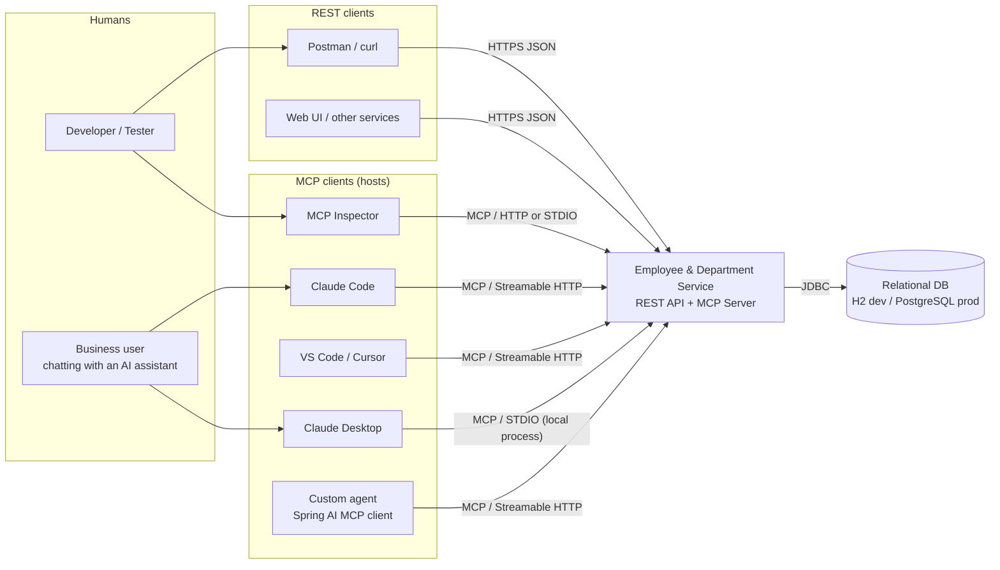

---

## 3. Key architectural decisions (ADR summary)

| # | Decision | Chosen option | Alternatives considered | Rationale |
|---|---|---|---|---|
| ADR-01 | How MCP tools reach business logic | **In-process: MCP tools call the same `Service` layer as REST controllers** | Separate MCP gateway app that calls the REST API over HTTP | One deployable, no double serialization, one validation path, transactional consistency. REST and MCP are two *adapters* over one core (hexagonal style). The gateway variant is described in §11 if the REST API must stay untouched or lives elsewhere. |
| ADR-02 | MCP framework | **Spring AI MCP Server Boot Starter (WebMVC)** | Raw MCP Java SDK; Spring AI WebFlux starter | Auto-configuration, `@Tool` annotation scanning, JSON schema generation from method signatures, fits a servlet (WebMVC) app that already serves REST. |
| ADR-03 | Remote transport | **Streamable HTTP** at `/mcp` | Legacy HTTP+SSE (`/sse` + `/mcp/message`), stateless HTTP | Streamable HTTP is the current MCP spec transport; one endpoint; supported by Claude Code, VS Code, Inspector. SSE stays a config switch for old clients. |
| ADR-04 | Local transport | **STDIO via Spring profile `stdio`** | Only HTTP + `mcp-remote` bridge | Claude Desktop and similar hosts launch local servers as processes. The `stdio` profile disables the web server and console logging so stdout stays a clean JSON-RPC channel. |
| ADR-05 | Server type | **SYNC** | ASYNC (Reactor) | Blocking JPA calls; simpler code; adequate for the expected load. |
| ADR-06 | Package layout | **Package-by-feature** (`department`, `employee`, `mcp`, `common`) | Package-by-layer | Keeps each aggregate cohesive; the `mcp` and `web` adapters stay thin. |
| ADR-07 | Schema management | **Flyway** migrations + seed data | `ddl-auto=update` | Repeatable, reviewable schema; same scripts for H2 and PostgreSQL. |
| ADR-08 | Error contract | REST: **RFC 9457 `ProblemDetail`**. MCP: **tool result with `isError=true`** and a human-readable message | Custom error JSON | Standard formats; LLM clients can read the error text and recover. |
| ADR-09 | Security (sample level) | **API key header** (`X-API-KEY`) on `/api/**` and `/mcp/**`, localhost binding + Origin check for MCP | Full OAuth 2.1 (MCP authorization spec) | Easy for any client to configure. The OAuth 2.1 resource-server upgrade path is in §9. |
| ADR-10 | DTO boundary | **Java records** for request/response; entities never leave the service layer | Expose entities | Avoids lazy-loading/recursion problems; gives clean tool JSON schemas. |

---

## 4. Container / deployment view

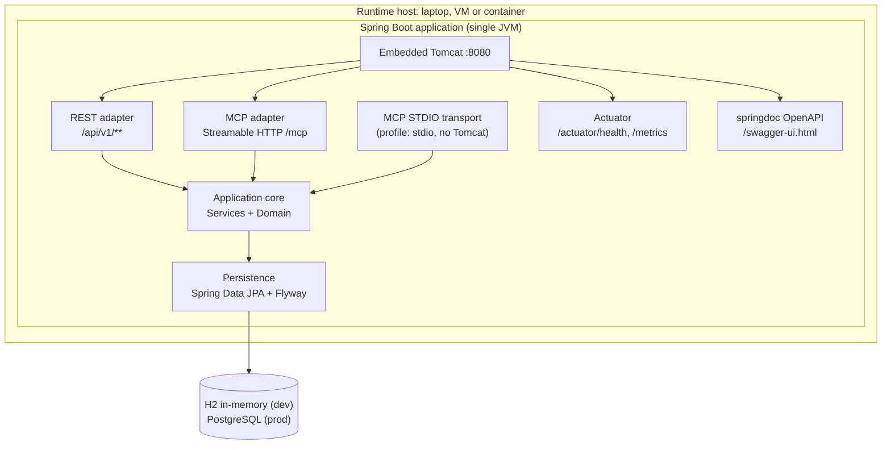

The same JAR runs in two modes:

| Mode | Command | Active interfaces |
|---|---|---|
| HTTP (default) | `java -jar app.jar` | REST, MCP Streamable HTTP, Swagger, Actuator |
| STDIO | `java -jar app.jar --spring.profiles.active=stdio` | MCP over stdin/stdout only |

---

## 5. Component view (hexagonal layering)

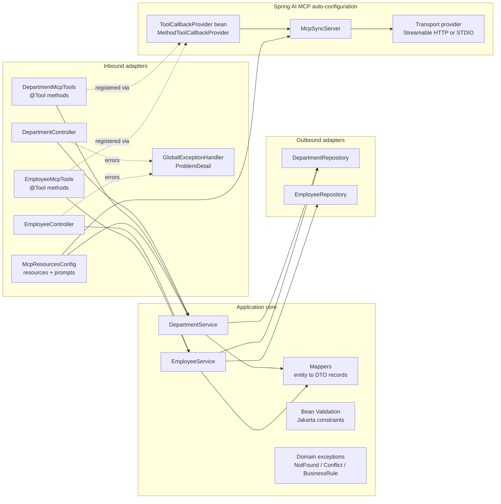

**Rule:** controllers and MCP tool classes contain no business logic. They validate the input shape, call one service
method, and return a DTO. This keeps REST and MCP behaviour the same.

### 5.1 Source layout

```
src/main/java/com/restmcp/demo/
├── RestApiMcpDemoApplication.java
├── common/
│   ├── exception/   NotFoundException, ConflictException, BusinessRuleException, GlobalExceptionHandler
│   └── api/         PageResponse<T>
├── department/
│   ├── Department.java              (JPA entity)
│   ├── DepartmentRepository.java
│   ├── DepartmentService.java
│   ├── DepartmentController.java
│   └── dto/  DepartmentRequest, DepartmentResponse, DepartmentSummary
├── employee/
│   ├── Employee.java                (JPA entity)
│   ├── EmployeeStatus.java          (enum)
│   ├── EmployeeRepository.java
│   ├── EmployeeService.java
│   ├── EmployeeController.java
│   └── dto/  EmployeeRequest, EmployeeResponse, EmployeeSearchCriteria
├── mcp/
│   ├── DepartmentMcpTools.java
│   ├── EmployeeMcpTools.java
│   ├── McpServerConfig.java         (ToolCallbackProvider, resources, prompts)
│   └── McpOriginValidationFilter.java
└── config/
    ├── SecurityConfig.java          (API key filter)
    └── OpenApiConfig.java
src/main/resources/
├── application.yml
├── application-stdio.yml
├── application-postgres.yml
└── db/migration/  V1__create_schema.sql, V2__seed_data.sql
```

---

## 6. Domain model

### 6.1 Entity relationship

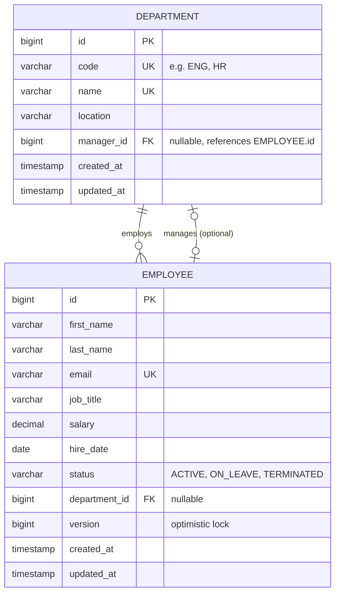

### 6.2 Class model

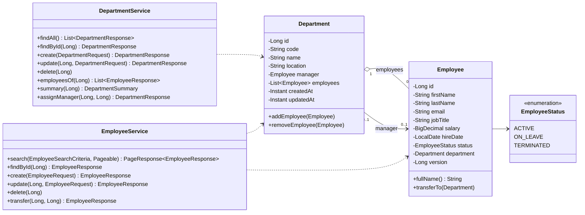

### 6.3 Business rules

| Rule | Enforced in | Error |
|---|---|---|
| Department `code` and `name` are unique | Service + DB unique constraint | 409 Conflict / MCP error |
| Employee `email` is unique | Service + DB unique constraint | 409 Conflict |
| Salary > 0, names not blank, email well-formed | Bean Validation on request records | 400 Bad Request |
| A department with employees cannot be deleted | `DepartmentService.delete` | 409 Conflict ("reassign N employees first") |
| A manager must belong to the department they manage | `DepartmentService.assignManager` | 422 Unprocessable |
| Transferring to the same department is a no-op error | `EmployeeService.transfer` | 422 Unprocessable |
| A `TERMINATED` employee cannot be transferred | `Employee.transferTo` | 422 Unprocessable |
| Concurrent updates | `@Version` optimistic locking | 409 Conflict |

### 6.4 Employee lifecycle

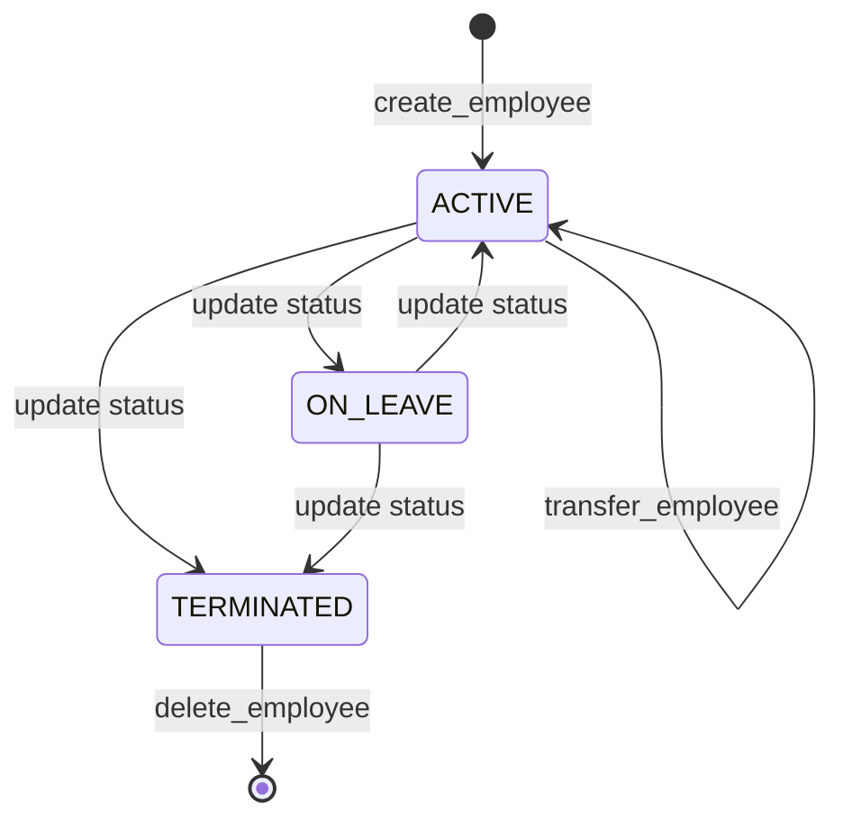

---

## 7. REST API design

Base path: `/api/v1`. JSON only. Errors use `application/problem+json`.

### 7.1 Departments

| Method | Path | Description | Success |
|---|---|---|---|
| GET | `/departments` | List all departments with headcount | 200 |
| GET | `/departments/{id}` | Get one department | 200 / 404 |
| POST | `/departments` | Create a department | 201 + `Location` |
| PUT | `/departments/{id}` | Replace a department | 200 / 404 / 409 |
| DELETE | `/departments/{id}` | Delete an empty department | 204 / 404 / 409 |
| GET | `/departments/{id}/employees` | Employees in the department | 200 / 404 |
| GET | `/departments/{id}/summary` | Headcount, total and average salary, manager | 200 / 404 |
| PUT | `/departments/{id}/manager/{employeeId}` | Assign a manager | 200 / 404 / 422 |

### 7.2 Employees

| Method | Path | Description | Success |
|---|---|---|---|
| GET | `/employees?name=&departmentId=&status=&page=&size=&sort=` | Search with paging | 200 |
| GET | `/employees/{id}` | Get one employee with department info | 200 / 404 |
| POST | `/employees` | Create an employee, optional `departmentId` | 201 / 409 |
| PUT | `/employees/{id}` | Update an employee | 200 / 404 / 409 |
| DELETE | `/employees/{id}` | Delete an employee | 204 / 404 |
| PUT | `/employees/{id}/department/{departmentId}` | Transfer to another department | 200 / 404 / 422 |

### 7.3 Payload examples

```json
// POST /api/v1/employees
{
  "firstName": "Asha",
  "lastName": "Rao",
  "email": "asha.rao@example.com",
  "jobTitle": "Software Engineer",
  "salary": 95000.00,
  "hireDate": "2026-09-01",
  "departmentId": 1
}
```

```json
// 201 Created
{
  "id": 42,
  "firstName": "Asha",
  "lastName": "Rao",
  "fullName": "Asha Rao",
  "email": "asha.rao@example.com",
  "jobTitle": "Software Engineer",
  "salary": 95000.00,
  "hireDate": "2026-09-01",
  "status": "ACTIVE",
  "department": { "id": 1, "code": "ENG", "name": "Engineering" }
}
```

```json
// 409 Conflict (application/problem+json)
{
  "type": "https://restmcp.demo/errors/conflict",
  "title": "Conflict",
  "status": 409,
  "detail": "Employee with email 'asha.rao@example.com' already exists",
  "instance": "/api/v1/employees"
}
```

### 7.4 REST request flow

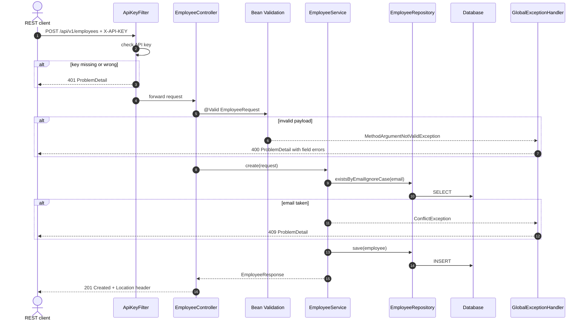

---

## 8. MCP server design

### 8.1 MCP concepts used

| MCP primitive | Controlled by | What we expose |
|---|---|---|
| **Tools** | The model decides when to call them | All read and write operations (§8.2) |
| **Resources** | The application or user attaches them as context | `org://departments` (directory), `org://departments/{code}/roster` (template) |
| **Prompts** | The user picks them, e.g. as slash commands | `onboard_employee`, `department_report` |

### 8.2 Tool catalogue

Tool names use `snake_case`. Descriptions are written for an LLM: say what the tool does, when to use it, and what it returns.

| Tool | Parameters | Returns | Delegates to | Kind |
|---|---|---|---|---|
| `list_departments` | — | `DepartmentResponse[]` | `DepartmentService.findAll` | read |
| `get_department` | `departmentId` | `DepartmentResponse` | `findById` | read |
| `get_department_employees` | `departmentId` | `EmployeeResponse[]` | `employeesOf` | read |
| `get_department_summary` | `departmentId` | `DepartmentSummary` | `summary` | read |
| `create_department` | `code, name, location` | `DepartmentResponse` | `create` | write |
| `update_department` | `departmentId, code, name, location` | `DepartmentResponse` | `update` | write |
| `delete_department` | `departmentId` | confirmation text | `delete` | destructive |
| `assign_department_manager` | `departmentId, employeeId` | `DepartmentResponse` | `assignManager` | write |
| `search_employees` | `name?, departmentId?, status?, page?, size?` | `PageResponse<EmployeeResponse>` | `EmployeeService.search` | read |
| `get_employee` | `employeeId` | `EmployeeResponse` | `findById` | read |
| `create_employee` | `firstName, lastName, email, jobTitle, salary, hireDate, departmentId?` | `EmployeeResponse` | `create` | write |
| `update_employee` | `employeeId` + fields | `EmployeeResponse` | `update` | write |
| `delete_employee` | `employeeId` | confirmation text | `delete` | destructive |
| `transfer_employee` | `employeeId, targetDepartmentId` | `EmployeeResponse` | `transfer` | write |

Write and destructive tools say so in their description ("Permanently deletes…"), so MCP hosts that ask the user to
confirm tool calls show a clear message.

### 8.3 Tool implementation pattern

```java
@Component
public class EmployeeMcpTools {

    private final EmployeeService employeeService;

    public EmployeeMcpTools(EmployeeService employeeService) {
        this.employeeService = employeeService;
    }

    @Tool(name = "transfer_employee",
          description = "Move an employee to a different department. Use get_employee or search_employees first "
                      + "to find the employee id, and list_departments to find the target department id. "
                      + "Returns the updated employee.")
    public EmployeeResponse transferEmployee(
            @ToolParam(description = "Numeric id of the employee to move") Long employeeId,
            @ToolParam(description = "Numeric id of the destination department") Long targetDepartmentId) {
        return employeeService.transfer(employeeId, targetDepartmentId);
    }
}
```

```java
@Configuration
public class McpServerConfig {

    @Bean
    ToolCallbackProvider employeeDepartmentTools(EmployeeMcpTools employeeTools,
                                                 DepartmentMcpTools departmentTools) {
        return MethodToolCallbackProvider.builder()
                .toolObjects(employeeTools, departmentTools)
                .build();
    }
}
```

Spring AI builds each tool's JSON input schema from the method signature and `@ToolParam` descriptions. The MCP
auto-configuration registers every `ToolCallbackProvider` bean with the `McpSyncServer`.

### 8.4 MCP session lifecycle (Streamable HTTP)

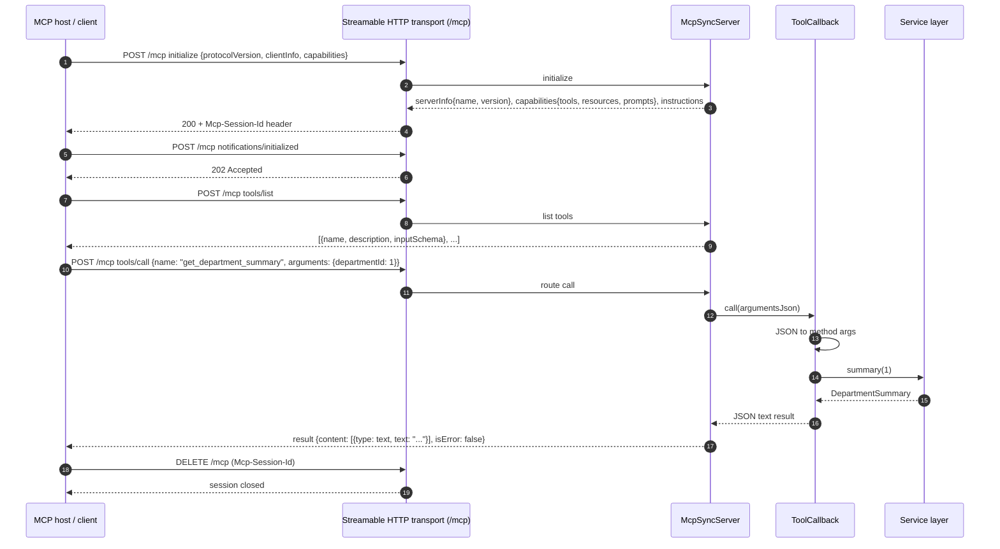

### 8.5 End-to-end: a user prompt becomes a tool call

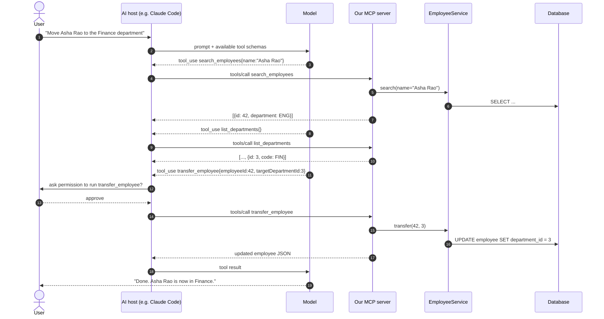

### 8.6 MCP error handling

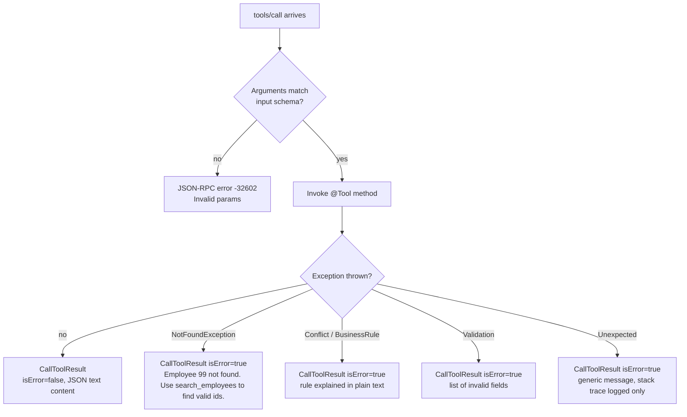

Business errors come back as **tool results with `isError=true`**, not as protocol errors. The model can read the
message and try again, for example by looking up a valid id. Domain exception messages are written to be useful to
the model. Internal details such as SQL or stack traces are never returned.

### 8.7 Resources and prompts

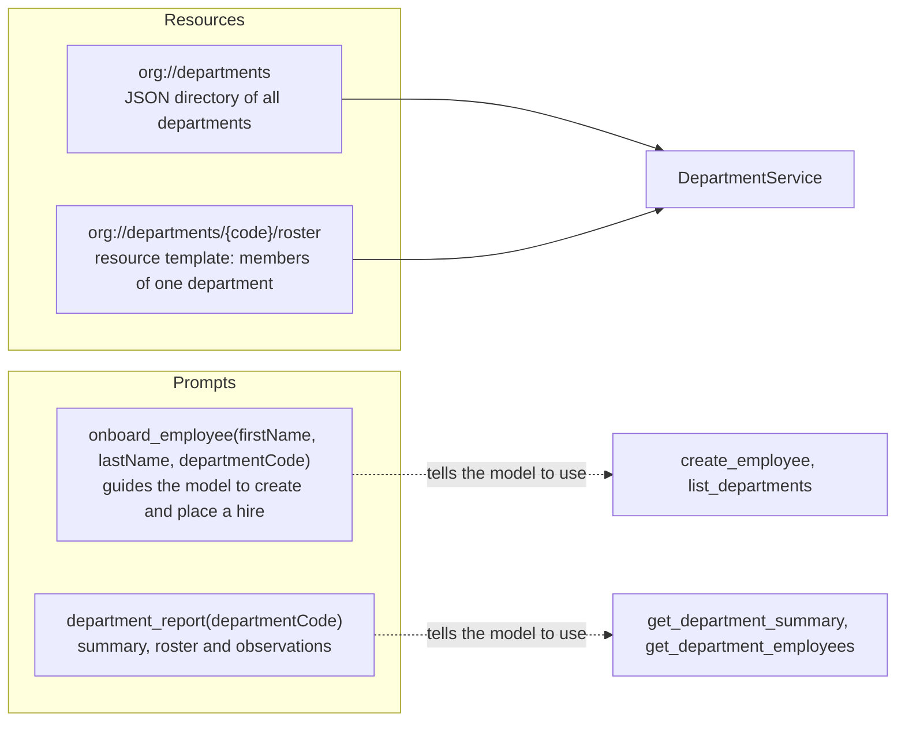

Registered as `List<McpServerFeatures.SyncResourceSpecification>` and `List<McpServerFeatures.SyncPromptSpecification>`
beans, which the Spring AI auto-configuration picks up. Spring AI 1.1's `@McpResource` / `@McpPrompt` annotations are
an alternative.

### 8.8 Transport configuration

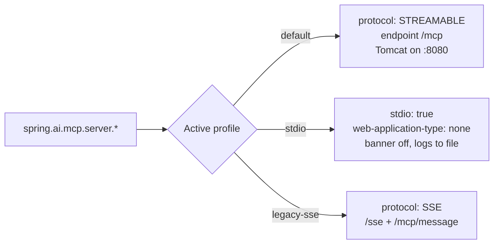

`application.yml` (default, HTTP):

```yaml
spring:
  application:
    name: rest-api-mcp-demo
  ai:
    mcp:
      server:
        name: employee-department-mcp
        version: 1.0.0
        type: SYNC
        protocol: STREAMABLE
        instructions: >
          Tools for an organisation's employees and departments. Look up ids with
          list_departments or search_employees before calling tools that need an id.
          Confirm with the user before delete_* or transfer_employee.
        capabilities:
          tool: true
          resource: true
          prompt: true
          completion: false
        streamable-http:
          mcp-endpoint: /mcp
```

`application-stdio.yml`:

```yaml
spring:
  main:
    web-application-type: none
    banner-mode: off
  ai:
    mcp:
      server:
        stdio: true
logging:
  pattern:
    console:            # nothing may be written to stdout except JSON-RPC
  file:
    name: ${java.io.tmpdir}/rest-api-mcp-demo.log
```

---

## 9. Security architecture

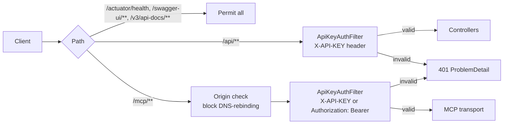

| Concern | Control |
|---|---|
| Authentication | API key from `APP_API_KEY` env var, compared in constant time. Off in the `dev` profile for easy demos. |
| DNS rebinding (MCP spec requirement for HTTP servers) | Validate the `Origin` header on `/mcp`. Bind to `127.0.0.1` by default (`server.address`). |
| Destructive operations | Tool descriptions mark them clearly. Hosts ask the user before calling. |
| Data exposure | DTOs only. Salary can be dropped from responses with a feature flag if needed. |
| Secrets | Never in `application.yml`. Read from env vars or a secret store. |
| Upgrade path | `spring-boot-starter-oauth2-resource-server` + JWT validation on `/mcp`, publish OAuth Protected Resource Metadata (`/.well-known/oauth-protected-resource`) as the MCP authorization spec requires. |

---

## 10. Cross-cutting concerns

| Concern | Approach |
|---|---|
| Validation | Jakarta Bean Validation on request records (`@NotBlank`, `@Email`, `@Positive`, `@PastOrPresent`). The service re-checks uniqueness rules. |
| Transactions | `@Transactional(readOnly = true)` on the service class, `@Transactional` on write methods. |
| N+1 queries | `@EntityGraph(attributePaths = "department")` on employee queries. Headcount via a `GROUP BY` projection. |
| Paging | `Pageable` with a max page size of 100, returned as `PageResponse<T>{content, page, size, totalElements, totalPages}` so MCP JSON stays stable. |
| Observability | Actuator health/info/metrics. Log line per tool call (`tool`, duration, outcome). Spring AI MCP observations through Micrometer. |
| API docs | springdoc-openapi at `/swagger-ui.html`. The MCP tool list is visible through MCP Inspector. |
| Config | Profiles: `default` (H2, HTTP), `stdio`, `postgres`, `dev` (security off). |
| Packaging | Executable JAR plus a Docker image (`eclipse-temurin:21-jre`, non-root user). |

---

## 11. Alternative topology: MCP gateway in front of an existing REST API

Use this when the REST service already exists, is owned by another team, or is written in another language.

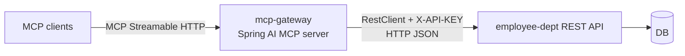

The `@Tool` classes stay the same, but they call a `RestClient`-based `EmployeeApiClient` instead of the service. The
gateway must translate HTTP 4xx `ProblemDetail` responses into `isError` tool results. Cost: an extra network hop,
two deployables and two error mappings. This repo uses the in-process design (ADR-01). The plan structures the code
so the gateway can be split out later without rewriting the tools.

---

## 12. Client integration matrix

| Client | Transport | Configuration |
|---|---|---|
| Claude Code | HTTP | `claude mcp add --transport http emp-dept http://localhost:8080/mcp --header "X-API-KEY: <key>"` |
| Claude Desktop | STDIO | `claude_desktop_config.json`: `{"mcpServers":{"emp-dept":{"command":"java","args":["-jar","<abs path>/rest-api-mcp-demo.jar","--spring.profiles.active=stdio"]}}}` |
| Claude Desktop (remote) | HTTP via bridge | `{"command":"npx","args":["-y","mcp-remote","http://localhost:8080/mcp","--header","X-API-KEY:<key>"]}` |
| VS Code (Copilot agent mode) | HTTP | `.vscode/mcp.json`: `{"servers":{"emp-dept":{"type":"http","url":"http://localhost:8080/mcp","headers":{"X-API-KEY":"<key>"}}}}` |
| Cursor | HTTP | `~/.cursor/mcp.json`: `{"mcpServers":{"emp-dept":{"url":"http://localhost:8080/mcp"}}}` |
| MCP Inspector | HTTP or STDIO | `npx @modelcontextprotocol/inspector`, then choose "Streamable HTTP" and `http://localhost:8080/mcp` |
| Spring AI client | HTTP | `spring.ai.mcp.client.streamable-http.connections.emp-dept.url=http://localhost:8080` |

---

## 13. Testing strategy

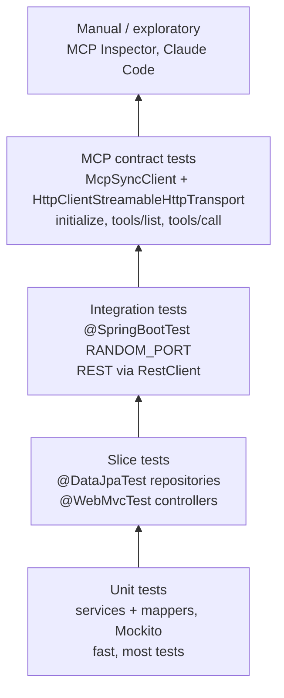

| Level | Proves |
|---|---|
| Unit | Business rules (§6.3) and mapping |
| `@DataJpaTest` | Flyway schema, constraints, custom queries, entity graphs |
| `@WebMvcTest` | Status codes, validation, ProblemDetail shape, JSON contract |
| REST integration | Whole stack with the real DB and security filter |
| MCP contract | The server advertises exactly the expected tool names and schemas; each tool returns correct data; business errors come back as `isError=true` |
| STDIO smoke | The JAR in the `stdio` profile writes only JSON-RPC to stdout |

---

## 14. Glossary

| Term | Meaning |
|---|---|
| MCP | Model Context Protocol: an open JSON-RPC 2.0 protocol for connecting AI hosts to tools and data |
| Host | The AI application (Claude Desktop, IDE) that runs MCP clients |
| Tool | A callable function with a JSON input schema, invoked when the model decides to |
| Resource | Read-only context addressed by URI |
| Prompt | A reusable, parameterised prompt template the user picks |
| Streamable HTTP | MCP transport over a single HTTP endpoint (POST for requests, optional SSE stream for responses) |
| STDIO | MCP transport where the host launches the server and talks over stdin/stdout |
