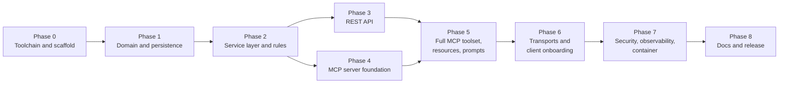

# Employee & Department REST + MCP Server — Implementation Plan

> **For the implementer:** work through the phases in order. Each task follows the same loop:
> **write a failing test → run it and watch it fail → write the minimum code → run it and watch it pass → commit.**
> Don't start a phase until the previous phase's exit criteria are green.

**Goal:** A Spring Boot service with REST endpoints for employees and departments. The same operations are exposed as
MCP tools, resources and prompts through an MCP server that any MCP client can use over Streamable HTTP or STDIO.

**Architecture:** One Spring Boot app in hexagonal layers. REST controllers and MCP tool classes are thin inbound
adapters over one service layer backed by Spring Data JPA. See [ARCHITECTURE.md](../architecture/ARCHITECTURE.md).

**Tech stack:** Java 21 · Spring Boot 3.5.x · Spring AI 1.1.x (`spring-ai-starter-mcp-server-webmvc`) · Spring Data JPA ·
Flyway · H2 (dev) / PostgreSQL (prod) · springdoc-openapi · JUnit 5 · Mockito · AssertJ · MCP Java SDK client (tests)

**Base package:** `com.restmcp.demo` · **Shell:** commands are written for Git Bash. On PowerShell, use `.\mvnw.cmd` instead of `./mvnw`.

---

## Phase map



Phases 3 and 4 both depend only on Phase 2, so they can run in parallel.

| Phase | Outcome | Rough effort |
|---|---|---|
| 0 | Project builds and boots on JDK 21 | 0.5 day |
| 1 | Schema, entities and repositories tested against H2 | 0.5 day |
| 2 | All business rules covered by unit tests | 1 day |
| 3 | REST API with validation, ProblemDetail and OpenAPI | 1 day |
| 4 | MCP server answers `initialize` / `tools/list`; first tool works in Inspector | 0.5 day |
| 5 | 14 tools + 2 resources + 2 prompts with contract tests | 1 day |
| 6 | Streamable HTTP + STDIO verified with Claude Code, Claude Desktop and VS Code | 0.5 day |
| 7 | API key, Origin check, actuator, Docker image | 1 day |
| 8 | README, client guides, tagged release | 0.5 day |

---

## Phase 0 — Toolchain and project scaffold

**Goal:** an empty Spring Boot app that builds, tests and boots.

### Task 0.1: Install the toolchain

- [ ] Install a JDK 21 (Eclipse Temurin): `winget install EclipseAdoptium.Temurin.21.JDK`
- [ ] Open a new terminal and check: `java -version` → `openjdk version "21..."`
- [ ] Check Node.js, which you need for MCP Inspector and `mcp-remote`: `node -v` → v20 or later
- [ ] You don't need a global Maven. The project ships the Maven Wrapper.

### Task 0.2: Generate the project

- [ ] Generate from start.spring.io (pick the newest **Spring Boot 3.5.x** that the current **Spring AI 1.1.x** supports):

```bash
curl -s https://start.spring.io/starter.zip \
  -d type=maven-project -d language=java -d javaVersion=21 \
  -d groupId=com.restmcp -d artifactId=rest-api-mcp-demo -d name=RestApiMcpDemo \
  -d packageName=com.restmcp.demo \
  -d dependencies=web,data-jpa,validation,h2,flyway,actuator,spring-ai-mcp-server \
  -o scaffold.zip
unzip -o scaffold.zip -d . && rm scaffold.zip
```

- [ ] Check that `pom.xml` contains the Spring AI BOM and the MCP server starter. Fix it if needed:

```xml
<properties>
    <java.version>21</java.version>
    <spring-ai.version>1.1.0</spring-ai.version> <!-- replace with the latest 1.1.x -->
</properties>

<dependencyManagement>
    <dependencies>
        <dependency>
            <groupId>org.springframework.ai</groupId>
            <artifactId>spring-ai-bom</artifactId>
            <version>${spring-ai.version}</version>
            <type>pom</type>
            <scope>import</scope>
        </dependency>
    </dependencies>
</dependencyManagement>

<dependency>
    <groupId>org.springframework.ai</groupId>
    <artifactId>spring-ai-starter-mcp-server-webmvc</artifactId>
</dependency>
```

- [ ] Add springdoc (outside the Spring BOM) and the PostgreSQL driver (runtime):

```xml
<dependency>
    <groupId>org.springdoc</groupId>
    <artifactId>springdoc-openapi-starter-webmvc-ui</artifactId>
    <version>2.8.x</version> <!-- latest 2.8.x -->
</dependency>
<dependency>
    <groupId>org.postgresql</groupId>
    <artifactId>postgresql</artifactId>
    <scope>runtime</scope>
</dependency>
<dependency>
    <groupId>org.flywaydb</groupId>
    <artifactId>flyway-database-postgresql</artifactId>
</dependency>
```

### Task 0.3: Housekeeping

- [ ] Create `.gitignore` covering `target/`, `.idea/`, `*.iml`, `*.log`, `.env`
- [ ] Remove the stray IntelliJ files from tracking: `.idea/` and `RestAPIMCPDemo.iml` are untracked today. Re-import the project in IntelliJ as a Maven project.
- [ ] Run: `./mvnw -q verify` → `BUILD SUCCESS` (the generated `contextLoads` test passes)
- [ ] Run: `./mvnw spring-boot:run` → log shows `Tomcat started on port 8080`. Stop with Ctrl+C.
- [ ] Commit: `chore: scaffold Spring Boot 3.5 + Spring AI MCP server project`

**Exit criteria:** `./mvnw verify` passes on a clean checkout.

---

## Phase 1 — Domain model and persistence

**Goal:** Flyway schema, JPA entities and repositories, all tested.

**Files:**
- Create `src/main/resources/db/migration/V1__create_schema.sql`
- Create `src/main/resources/db/migration/V2__seed_data.sql`
- Create `src/main/java/com/restmcp/demo/department/Department.java`, `DepartmentRepository.java`
- Create `src/main/java/com/restmcp/demo/employee/Employee.java`, `EmployeeStatus.java`, `EmployeeRepository.java`
- Test `src/test/java/com/restmcp/demo/employee/EmployeeRepositoryTest.java`, `.../department/DepartmentRepositoryTest.java`

### Task 1.1: Base configuration

- [ ] Replace `application.properties` with `src/main/resources/application.yml`:

```yaml
spring:
  application:
    name: rest-api-mcp-demo
  datasource:
    url: jdbc:h2:mem:empdept;DB_CLOSE_DELAY=-1;MODE=PostgreSQL
    username: sa
    password:
  jpa:
    open-in-view: false
    hibernate:
      ddl-auto: validate
  flyway:
    enabled: true
  h2:
    console:
      enabled: true
```

### Task 1.2: Schema migration

- [ ] `V1__create_schema.sql`:

```sql
CREATE TABLE department (
    id          BIGINT GENERATED BY DEFAULT AS IDENTITY PRIMARY KEY,
    code        VARCHAR(20)  NOT NULL UNIQUE,
    name        VARCHAR(100) NOT NULL UNIQUE,
    location    VARCHAR(100),
    manager_id  BIGINT,
    created_at  TIMESTAMP    NOT NULL,
    updated_at  TIMESTAMP    NOT NULL
);

CREATE TABLE employee (
    id            BIGINT GENERATED BY DEFAULT AS IDENTITY PRIMARY KEY,
    first_name    VARCHAR(50)    NOT NULL,
    last_name     VARCHAR(50)    NOT NULL,
    email         VARCHAR(120)   NOT NULL UNIQUE,
    job_title     VARCHAR(80)    NOT NULL,
    salary        DECIMAL(12, 2) NOT NULL CHECK (salary > 0),
    hire_date     DATE           NOT NULL,
    status        VARCHAR(20)    NOT NULL,
    department_id BIGINT REFERENCES department (id),
    version       BIGINT         NOT NULL DEFAULT 0,
    created_at    TIMESTAMP      NOT NULL,
    updated_at    TIMESTAMP      NOT NULL
);

ALTER TABLE department
    ADD CONSTRAINT fk_department_manager FOREIGN KEY (manager_id) REFERENCES employee (id);

CREATE INDEX idx_employee_department ON employee (department_id);
CREATE INDEX idx_employee_last_name ON employee (last_name);
```

- [ ] `V2__seed_data.sql`: 4 departments (ENG, HR, FIN, SALES) and about 12 employees. Set one manager per department with an `UPDATE` after the inserts.

### Task 1.3: Entities

- [ ] `EmployeeStatus` enum: `ACTIVE, ON_LEAVE, TERMINATED`.
- [ ] `Department`: `@Entity`. Fields as in ARCHITECTURE §6.2. `@OneToMany(mappedBy = "department") List<Employee> employees`. `@OneToOne(fetch = LAZY) @JoinColumn(name = "manager_id") Employee manager`. `@PrePersist` / `@PreUpdate` set the timestamps.
- [ ] `Employee`: `@Entity`. `@ManyToOne(fetch = LAZY) Department department`, `@Enumerated(STRING) status`, `@Version Long version`. Add a domain method:

```java
public void transferTo(Department target) {
    if (status == EmployeeStatus.TERMINATED) {
        throw new BusinessRuleException("Employee %d is TERMINATED and cannot be transferred".formatted(id));
    }
    if (department != null && department.getId().equals(target.getId())) {
        throw new BusinessRuleException("Employee %d is already in department %s".formatted(id, target.getCode()));
    }
    this.department = target;
}
```

(Create `common/exception/BusinessRuleException.java`, `NotFoundException.java` and `ConflictException.java` now. Each is a `RuntimeException` with a message constructor.)

### Task 1.4: Repositories (TDD)

- [ ] **Write the failing test** `EmployeeRepositoryTest` (`@DataJpaTest`). It uses the seed data and asserts that:
  - `findByDepartmentId(engId)` returns the ENG employees
  - `existsByEmailIgnoreCase("ASHA.RAO@EXAMPLE.COM")` is true for a seeded email
  - `search("rao", null, null, PageRequest.of(0, 10))` matches on first or last name, case-insensitive
- [ ] Run `./mvnw -q test -Dtest=EmployeeRepositoryTest` → FAIL (methods don't exist yet)
- [ ] Implement `EmployeeRepository extends JpaRepository<Employee, Long>`:

```java
@EntityGraph(attributePaths = "department")
List<Employee> findByDepartmentId(Long departmentId);

boolean existsByEmailIgnoreCase(String email);

long countByDepartmentId(Long departmentId);

@EntityGraph(attributePaths = "department")
@Query("""
       select e from Employee e
       where (:name is null or lower(concat(e.firstName, ' ', e.lastName)) like lower(concat('%', :name, '%')))
         and (:departmentId is null or e.department.id = :departmentId)
         and (:status is null or e.status = :status)
       """)
Page<Employee> search(String name, Long departmentId, EmployeeStatus status, Pageable pageable);
```

- [ ] Write `DepartmentRepositoryTest` + implement `DepartmentRepository`: `findByCodeIgnoreCase`, `existsByCodeIgnoreCase`, `existsByNameIgnoreCase`, and a headcount projection:

```java
@Query("select d.id as id, count(e) as headcount, coalesce(sum(e.salary), 0) as totalSalary, "
     + "coalesce(avg(e.salary), 0) as averageSalary "
     + "from Department d left join d.employees e where d.id = :id group by d.id")
Optional<DepartmentStats> statsFor(Long id);
```

- [ ] Run `./mvnw -q test` → PASS
- [ ] Commit: `feat(domain): add department/employee schema, entities and repositories`

**Exit criteria:** Flyway migrates on boot, `ddl-auto=validate` passes, repository tests are green.

---

## Phase 2 — Service layer, DTOs and business rules

**Goal:** all rules from ARCHITECTURE §6.3 are enforced and unit-tested. No web code yet.

**Files:**
- Create `department/dto/DepartmentRequest.java`, `DepartmentResponse.java`, `DepartmentSummary.java`
- Create `employee/dto/EmployeeRequest.java`, `EmployeeResponse.java`, `EmployeeSearchCriteria.java`
- Create `common/api/PageResponse.java`
- Create `department/DepartmentService.java`, `employee/EmployeeService.java`
- Test `department/DepartmentServiceTest.java`, `employee/EmployeeServiceTest.java`

### Task 2.1: DTO records

```java
public record EmployeeRequest(
        @NotBlank @Size(max = 50) String firstName,
        @NotBlank @Size(max = 50) String lastName,
        @NotBlank @Email @Size(max = 120) String email,
        @NotBlank @Size(max = 80) String jobTitle,
        @NotNull @Positive BigDecimal salary,
        @NotNull @PastOrPresent LocalDate hireDate,
        EmployeeStatus status,          // null means ACTIVE on create
        Long departmentId) {}

public record EmployeeResponse(Long id, String firstName, String lastName, String fullName, String email,
        String jobTitle, BigDecimal salary, LocalDate hireDate, EmployeeStatus status, DepartmentRef department) {
    public record DepartmentRef(Long id, String code, String name) {}
    public static EmployeeResponse from(Employee e) { /* null-safe department mapping */ }
}

public record DepartmentRequest(@NotBlank @Size(max = 20) @Pattern(regexp = "[A-Z0-9_]+") String code,
                                @NotBlank @Size(max = 100) String name,
                                @Size(max = 100) String location) {}

public record DepartmentResponse(Long id, String code, String name, String location,
                                 Long managerId, String managerName, long headcount) {}

public record DepartmentSummary(Long id, String code, String name, long headcount,
                                BigDecimal totalSalary, BigDecimal averageSalary, String managerName) {}

public record PageResponse<T>(List<T> content, int page, int size, long totalElements, int totalPages) {
    public static <T> PageResponse<T> from(Page<T> p) { /* ... */ }
}
```

- [ ] Commit: `feat(api): add request/response records`

### Task 2.2: EmployeeService (TDD, one rule at a time)

For each row below: write the failing Mockito test, run it and watch it fail, implement, run it and watch it pass.

| # | Test name | Expectation |
|---|---|---|
| 1 | `findById_unknownId_throwsNotFound` | `NotFoundException("Employee 99 not found")` |
| 2 | `create_duplicateEmail_throwsConflict` | `ConflictException` mentioning the email |
| 3 | `create_unknownDepartment_throwsNotFound` | `NotFoundException("Department 7 not found")` |
| 4 | `create_valid_defaultsStatusActive_andSaves` | Saved entity has status `ACTIVE` and the department set |
| 5 | `update_changingEmailToExisting_throwsConflict` | Conflict, unless it is the employee's own email |
| 6 | `transfer_toSameDepartment_throwsBusinessRule` | `BusinessRuleException` |
| 7 | `transfer_terminated_throwsBusinessRule` | `BusinessRuleException` |
| 8 | `transfer_valid_updatesDepartment` | Response has the new department |
| 9 | `search_capsPageSizeAt100` | Repository called with size 100 when 500 is requested |
| 10 | `delete_managerOfDepartment_clearsManagerFirst` | `department.manager` becomes null, then the employee is deleted |

- [ ] Annotate the class `@Service @Transactional(readOnly = true)` and the write methods `@Transactional`.
- [ ] Write exception messages for an LLM reader, for example: `"Employee 99 not found. Use search_employees to find valid employee ids."`
- [ ] Commit after the rows pass: `feat(employee): implement EmployeeService with business rules`

### Task 2.3: DepartmentService (TDD)

| # | Test name | Expectation |
|---|---|---|
| 1 | `create_duplicateCode_throwsConflict` | Conflict |
| 2 | `create_duplicateName_throwsConflict` | Conflict |
| 3 | `delete_withEmployees_throwsConflict` | `"Department ENG still has 5 employees. Transfer them before deleting."` |
| 4 | `delete_empty_deletes` | `repository.delete` called |
| 5 | `employeesOf_unknown_throwsNotFound` | NotFound |
| 6 | `summary_returnsStatsAndManager` | Headcount, totals and manager name mapped |
| 7 | `assignManager_employeeInOtherDept_throwsBusinessRule` | BusinessRule |
| 8 | `findAll_includesHeadcount` | Headcount filled in from the count query |

- [ ] Commit: `feat(department): implement DepartmentService with business rules`

**Exit criteria:** `./mvnw test` is green. Every rule in ARCHITECTURE §6.3 has at least one test.

---

## Phase 3 — REST API

**Goal:** the endpoints from ARCHITECTURE §7 with validation, ProblemDetail errors and OpenAPI docs.

**Files:**
- Create `common/exception/GlobalExceptionHandler.java`
- Create `department/DepartmentController.java`, `employee/EmployeeController.java`
- Create `config/OpenApiConfig.java`
- Test `department/DepartmentControllerTest.java`, `employee/EmployeeControllerTest.java` (`@WebMvcTest`)
- Test `RestApiIntegrationTest.java` (`@SpringBootTest(webEnvironment = RANDOM_PORT)`)
- Create `http/requests.http` (IntelliJ HTTP client scratch file for manual checks)

### Task 3.1: Error mapping (TDD)

- [ ] Failing `@WebMvcTest` test: `GET /api/v1/employees/99` when the service throws NotFound → `404`, `Content-Type: application/problem+json`, `$.detail` contains "not found".
- [ ] Implement `GlobalExceptionHandler extends ResponseEntityExceptionHandler` (`@RestControllerAdvice`):

| Exception | Status |
|---|---|
| `NotFoundException` | 404 |
| `ConflictException`, `ObjectOptimisticLockingFailureException`, `DataIntegrityViolationException` | 409 |
| `BusinessRuleException` | 422 |
| `MethodArgumentNotValidException` | 400 + `errors: [{field, message}]` property |
| Anything else | 500 with a generic detail. Log the stack trace. |

- [ ] Set `spring.mvc.problemdetails.enabled: true` in `application.yml`.

### Task 3.2: Controllers (TDD per endpoint)

- [ ] For each endpoint in ARCHITECTURE §7.1 and §7.2: write a `@WebMvcTest` test (happy path + main error), then implement.
- [ ] `POST` endpoints return `ResponseEntity.created(uri).body(dto)`.
- [ ] `GET /employees` binds `@ModelAttribute EmployeeSearchCriteria` + `@PageableDefault(size = 20, sort = "lastName") Pageable`.
- [ ] Add `@Operation` / `@Tag` annotations for OpenAPI.

### Task 3.3: Full-stack REST test

- [ ] `RestApiIntegrationTest` uses `RestClient` against the random port. Scenario: create department → create employee in it → transfer to FIN → `GET /departments/{fin}/summary` shows headcount +1 → try to delete the original department while it still has employees → 409.
- [ ] Run `./mvnw verify` → PASS

### Task 3.4: Manual check

- [ ] `./mvnw spring-boot:run`, then:

```bash
curl -s localhost:8080/api/v1/departments | jq
curl -s "localhost:8080/api/v1/employees?name=rao&size=5" | jq
curl -s -X PUT localhost:8080/api/v1/employees/1/department/3 | jq
```

- [ ] Open `http://localhost:8080/swagger-ui.html` and check that every endpoint is listed.
- [ ] Commit: `feat(rest): expose employee and department REST endpoints with ProblemDetail errors`

**Exit criteria:** every endpoint in §7 is implemented and tested, and Swagger UI loads.

---

## Phase 4 — MCP server foundation

**Goal:** the MCP server starts, completes the `initialize` handshake and serves one read tool end-to-end.

**Files:**
- Modify `src/main/resources/application.yml` (add the `spring.ai.mcp.server` block)
- Create `mcp/DepartmentMcpTools.java`, `mcp/McpServerConfig.java`
- Test `mcp/McpServerContractTest.java`

### Task 4.1: Server configuration

- [ ] Add to `application.yml`. This is the full block from ARCHITECTURE §8.8: name `employee-department-mcp`, `type: SYNC`, `protocol: STREAMABLE`, `streamable-http.mcp-endpoint: /mcp`, `instructions`, and `capabilities.tool/resource/prompt: true`.

### Task 4.2: First tool, contract-test first

- [ ] **Write the failing test** `McpServerContractTest`:

```java
@SpringBootTest(webEnvironment = SpringBootTest.WebEnvironment.RANDOM_PORT)
class McpServerContractTest {

    @LocalServerPort int port;
    McpSyncClient client;

    @BeforeEach
    void connect() {
        var transport = HttpClientStreamableHttpTransport.builder("http://localhost:" + port)
                .endpoint("/mcp")
                .build();
        client = McpClient.sync(transport).requestTimeout(Duration.ofSeconds(10)).build();
        client.initialize();
    }

    @AfterEach
    void close() { client.closeGracefully(); }

    @Test
    void advertisesServerInfo() {
        assertThat(client.getServerInfo().name()).isEqualTo("employee-department-mcp");
    }

    @Test
    void listDepartmentsToolReturnsSeededDepartments() {
        var tools = client.listTools().tools().stream().map(McpSchema.Tool::name).toList();
        assertThat(tools).contains("list_departments");

        var result = client.callTool(new McpSchema.CallToolRequest("list_departments", Map.of()));
        assertThat(result.isError()).isFalse();
        assertThat(((McpSchema.TextContent) result.content().get(0)).text()).contains("ENG", "HR", "FIN");
    }
}
```

- [ ] Run `./mvnw -q test -Dtest=McpServerContractTest` → FAIL (the tool isn't registered)
- [ ] Implement `DepartmentMcpTools` with just `list_departments` (`@Tool` delegating to `DepartmentService.findAll`), plus `McpServerConfig` with the `ToolCallbackProvider` bean (ARCHITECTURE §8.3).
- [ ] Run the test again → PASS
- [ ] Commit: `feat(mcp): bootstrap MCP server with list_departments tool`

### Task 4.3: Check with MCP Inspector

- [ ] `./mvnw spring-boot:run`
- [ ] `npx @modelcontextprotocol/inspector` → Transport **Streamable HTTP**, URL `http://localhost:8080/mcp` → **Connect**
- [ ] Tools tab → `list_departments` is listed with its description → **Run** → JSON comes back

**Exit criteria:** contract test green, Inspector connects and runs the tool.

---

## Phase 5 — Complete MCP toolset, resources and prompts

**Goal:** all 14 tools from ARCHITECTURE §8.2, plus 2 resources and 2 prompts, each covered by the contract test.

### Task 5.1: Department tools

- [ ] Extend the contract test with one `callTool` assertion per tool, using a parameterized test where it fits. Watch it fail.
- [ ] Implement in `DepartmentMcpTools`: `get_department`, `get_department_employees`, `get_department_summary`, `create_department`, `update_department`, `delete_department`, `assign_department_manager`.
- [ ] Description guidelines:
  - First sentence: what the tool does. Second: when to use it or what to call first. Third: what it returns.
  - Destructive tools start with "Permanently…" and say the user should confirm first.
  - Each `@ToolParam` description names the unit or format (e.g. "ISO date yyyy-MM-dd", "uppercase code like ENG").

### Task 5.2: Employee tools

- [ ] Implement `EmployeeMcpTools`: `search_employees`, `get_employee`, `create_employee`, `update_employee`, `delete_employee`, `transfer_employee`.
- [ ] For `search_employees`, make every parameter optional with `@ToolParam(required = false)`, and default `page=0, size=20` in the method body.
- [ ] Register `EmployeeMcpTools` in the `ToolCallbackProvider` bean.

### Task 5.3: Error behaviour (TDD)

- [ ] Add these contract tests:
  - `get_employee` with `employeeId=999999` → `isError() == true` and the text contains "not found"
  - `delete_department` on ENG → `isError() == true` and the text contains "Transfer them before deleting"
  - `create_employee` with a duplicate email → `isError() == true`
- [ ] Check that the error text never contains `Exception`, `SQL` or a package name. If it does, add a small `ToolExecutionExceptionProcessor` bean that returns `ex.getMessage()` for domain exceptions and a generic message for everything else.

### Task 5.4: Schema snapshot test

- [ ] Add a test that serializes `listTools()` (name + inputSchema) and compares it with `src/test/resources/mcp/tools-snapshot.json`. Any change to a tool contract then shows up in code review.

### Task 5.5: Resources and prompts

- [ ] Add a `mcp/OrgResources.java` component using the Spring AI 1.1 MCP annotations (`org.springaicommunity.mcp.annotation`):

```java
@McpResource(uri = "org://departments", name = "Department directory",
             description = "All departments with code, location, manager and headcount", mimeType = "application/json")
public String departmentDirectory() { return json(departmentService.findAll()); }

@McpResource(uri = "org://departments/{code}/roster", name = "Department roster",
             description = "Employees of the department with the given code", mimeType = "application/json")
public String roster(String code) { return json(departmentService.rosterByCode(code)); }
```

- [ ] Add `mcp/OrgPrompts.java`:

```java
@McpPrompt(name = "department_report", description = "Write a short report about one department")
public GetPromptResult departmentReport(@McpArg(name = "departmentCode", required = true) String code) {
    return new GetPromptResult("Department report", List.of(new PromptMessage(Role.USER, new TextContent(
        "Use get_department_summary and get_department_employees for department " + code
        + ". Report headcount, salary spread, open manager role (if any) and notable observations."))));
}
```

  and `onboard_employee(firstName, lastName, departmentCode)` in the same style.
- [ ] If the annotation module isn't on the classpath for your Spring AI version, register `List<McpServerFeatures.SyncResourceSpecification>` and `List<McpServerFeatures.SyncPromptSpecification>` beans in `McpServerConfig` instead. The auto-configuration picks up both styles.
- [ ] Contract tests: `client.listResources()` contains `org://departments`. `client.readResource(...)` returns JSON with ENG. `client.getPrompt("department_report", Map.of("departmentCode","ENG"))` returns one message.
- [ ] Commit: `feat(mcp): expose full employee/department toolset, resources and prompts`

**Exit criteria:** `tools/list` returns exactly 14 tools that match the snapshot. Resource and prompt tests are green.

---

## Phase 6 — Transports and client onboarding

**Goal:** the server works with real MCP clients over both HTTP and STDIO.

### Task 6.1: STDIO profile

- [ ] Create `application-stdio.yml` (ARCHITECTURE §8.8).
- [ ] Create `src/main/resources/logback-spring.xml` with `<springProfile name="stdio">`: a file appender only, **no console appender**.
- [ ] Build: `./mvnw -q package -DskipTests` → `target/rest-api-mcp-demo-0.0.1-SNAPSHOT.jar`
- [ ] STDIO smoke test (stdout must contain only JSON-RPC):

```bash
printf '%s\n' '{"jsonrpc":"2.0","id":1,"method":"initialize","params":{"protocolVersion":"2025-06-18","capabilities":{},"clientInfo":{"name":"smoke","version":"1"}}}' \
  | java -jar target/rest-api-mcp-demo-0.0.1-SNAPSHOT.jar --spring.profiles.active=stdio \
  | head -1 | jq .result.serverInfo
```
Expected: `{"name":"employee-department-mcp","version":"1.0.0"}` with no banner or log lines before it.

- [ ] Automate the same check as `StdioTransportIT`. Run the jar through `ServerParameters` + `StdioClientTransport` (MCP Java SDK), call `list_departments`, and bind it to the Maven Failsafe `integration-test` phase.

### Task 6.2: Optional legacy SSE profile

- [ ] `application-legacy-sse.yml` with `spring.ai.mcp.server.protocol: SSE`. For older clients only. Check with Inspector using the "SSE" transport at `http://localhost:8080/sse`.

### Task 6.3: Connect real clients

- [ ] **Claude Code:** `claude mcp add --transport http emp-dept http://localhost:8080/mcp`, then `claude mcp list` → connected. Ask: "Which department has the highest average salary?" → the model calls `list_departments` and `get_department_summary`.
- [ ] **Claude Desktop (STDIO):** add to `%APPDATA%\Claude\claude_desktop_config.json`:

```json
{
  "mcpServers": {
    "emp-dept": {
      "command": "java",
      "args": ["-jar", "E:\\Pavan\\workspace\\RestAPIMCPDemo\\target\\rest-api-mcp-demo-0.0.1-SNAPSHOT.jar",
               "--spring.profiles.active=stdio"]
    }
  }
}
```

  Restart Claude Desktop → the tools icon lists 14 tools → ask "Transfer employee 3 to HR" → a confirmation prompt appears → success.
- [ ] **VS Code:** create `.vscode/mcp.json` with the `http` server entry (ARCHITECTURE §12) → Copilot Chat agent mode → the tools are listed.
- [ ] Record each client's result in `docs/guides/client-setup.md` with screenshots.
- [ ] Commit: `feat(mcp): add stdio profile and client setup guide`

**Exit criteria:** at least one HTTP client and one STDIO client run a read tool and a write tool successfully.

---

## Phase 7 — Security, observability, packaging

### Task 7.1: API key filter (TDD)

- [ ] Tests: `/api/v1/departments` without a key → 401 ProblemDetail. With a key → 200. `/mcp` without a key → 401. `/actuator/health` without a key → 200.
- [ ] Implement `config/ApiKeyAuthFilter` (`OncePerRequestFilter`). It reads `app.security.api-key` (from env `APP_API_KEY`), accepts `X-API-KEY` or `Authorization: Bearer <key>`, and compares with `MessageDigest.isEqual`. Register it for `/api/*`, `/mcp` and `/mcp/*`. Turn it off when `app.security.enabled=false` (the `dev` profile).
- [ ] Update `McpServerContractTest` to send the header: `HttpClientStreamableHttpTransport.builder(...).customizeRequest(b -> b.header("X-API-KEY", KEY))`.

### Task 7.2: Origin validation on MCP (TDD)

- [ ] Test: `POST /mcp` with `Origin: http://evil.example` → 403. No Origin header → allowed. `Origin: http://localhost:6274` (Inspector) → allowed.
- [ ] Implement `mcp/McpOriginValidationFilter` with an allow-list in `app.mcp.allowed-origins`.
- [ ] Default `server.address: 127.0.0.1`. The Docker profile overrides it with `0.0.0.0`.

### Task 7.3: Observability

- [ ] Actuator: expose `health,info,metrics`. Add `info.app.*` with the version.
- [ ] Add an `@Aspect` or a decorator around tool callbacks that logs `tool=<name> durationMs=<n> outcome=<ok|error>` at INFO. In the STDIO profile this goes to the file appender.
- [ ] Test: call a tool, then assert the `mcp.tool.calls` Micrometer counter went up.

### Task 7.4: PostgreSQL profile and container

- [ ] `application-postgres.yml`: datasource from `DB_URL`, `DB_USER`, `DB_PASSWORD`.
- [ ] Multi-stage `Dockerfile` (`eclipse-temurin:21-jdk` builds, `eclipse-temurin:21-jre` runs, non-root user, `EXPOSE 8080`).
- [ ] `docker-compose.yml`: `app` + `postgres:16`, env-based config, healthchecks.
- [ ] Check: `docker compose up --build` → `curl -H "X-API-KEY: $KEY" localhost:8080/api/v1/departments` → 200. Inspector connects to `http://localhost:8080/mcp` with the header.
- [ ] Optional: add Testcontainers PostgreSQL to the integration tests.
- [ ] Commit: `feat(ops): add API key security, origin validation, metrics, docker packaging`

**Exit criteria:** security tests green, and the container runs against PostgreSQL.

---

## Phase 8 — Documentation and release

- [ ] `README.md`: purpose, architecture diagram (link to ARCHITECTURE.md), quick start (HTTP and STDIO), the REST endpoint table, the MCP tool table, client setup snippets, configuration reference (env vars), and how to run the tests.
- [ ] `docs/guides/client-setup.md` finished (Phase 6).
- [ ] Update ARCHITECTURE.md where the implementation changed from the design, and record those changes as ADRs.
- [ ] Final check on a clean clone: `./mvnw clean verify` → all unit, slice, integration and MCP contract tests pass.
- [ ] Tag: `git tag v1.0.0`
- [ ] Commit: `docs: finalize README, client guide and architecture`

---

## Verification checklist (definition of done)

| Check | Command / action | Expected |
|---|---|---|
| Build + all tests | `./mvnw clean verify` | BUILD SUCCESS |
| REST works | `curl localhost:8080/api/v1/departments` | JSON list of 4 seeded departments |
| OpenAPI | open `/swagger-ui.html` | All 14 endpoints shown |
| MCP handshake | Inspector → Streamable HTTP → `/mcp` | Connected, server name `employee-department-mcp` |
| MCP tools | Inspector Tools tab | 14 tools, each with a description and input schema |
| MCP errors | call `get_employee` with id 999999 | `isError: true`, readable message |
| MCP resources/prompts | Inspector Resources / Prompts tabs | `org://departments`, `department_report`, `onboard_employee` |
| STDIO | smoke command in Task 6.1 | Clean JSON-RPC on stdout |
| Real client | Claude Code / Desktop: "list employees in Engineering" | Correct answer from tool calls |
| Security | request with no key | 401 |

## Risks and mitigations

| Risk | Mitigation |
|---|---|
| Spring AI MCP property names or annotation packages move between minor versions | Pin versions in Phase 0. The contract tests catch regressions. Check the Spring AI MCP Server reference docs for the pinned version. |
| Lazy-loading errors when serializing entities to tool JSON | DTO records only (ADR-10), `open-in-view: false`, entity graphs |
| STDIO stdout polluted by logs or the banner | Dedicated profile + logback config + automated STDIO IT |
| The LLM picks the wrong tool or passes made-up ids | Clear descriptions that say "look up the id first", plus actionable error messages |
| Destructive tools called by accident | Descriptions flag them. Hosts ask for confirmation. An optional `app.mcp.read-only=true` flag registers only read tools. |
| Client compatibility with transports | Streamable HTTP is the default. SSE profile for legacy clients. `mcp-remote` bridge for STDIO-only hosts. |
